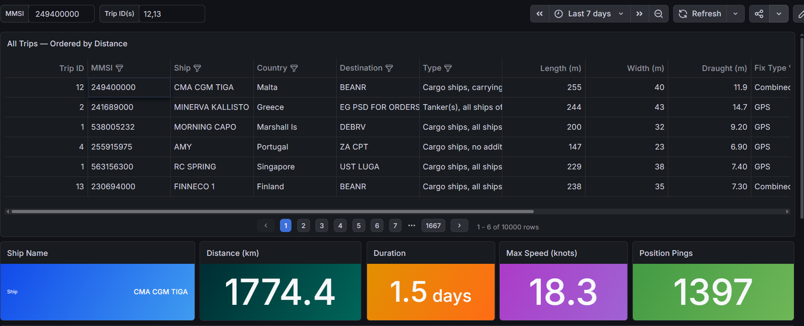
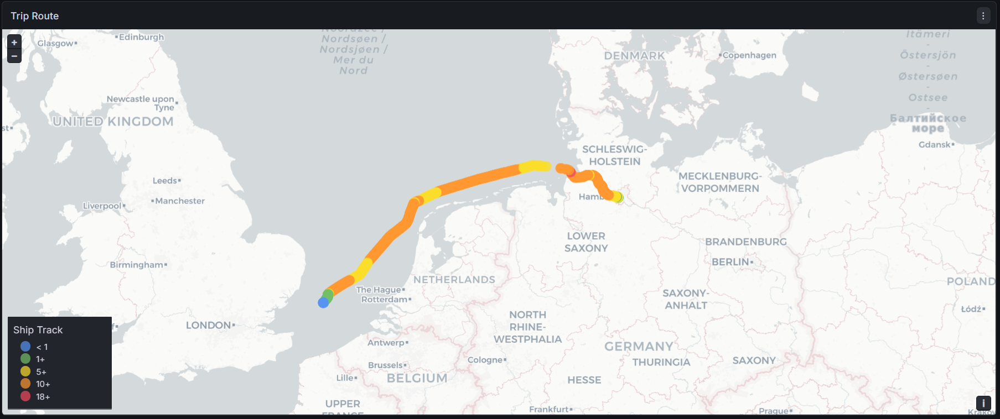
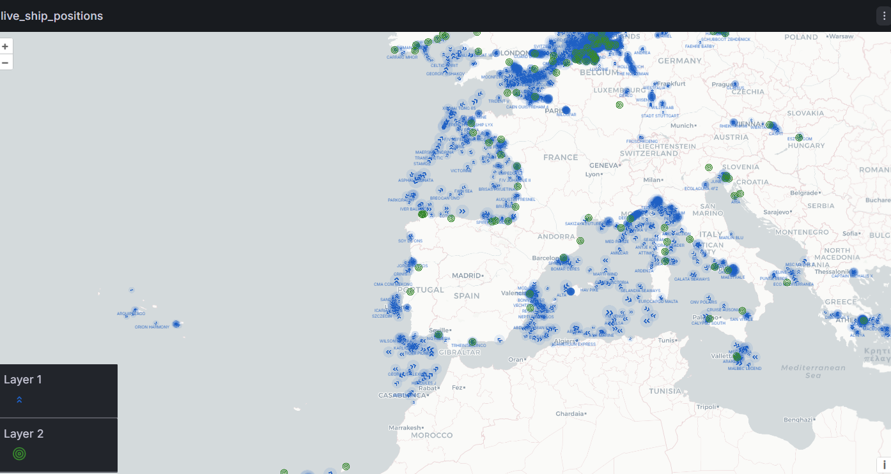

# 🚢 Real-Time AIS Stream Data Lakehouse




## Executive Summary
This project is an end-to-end data engineering pipeline that processes live Automatic Identification System (AIS) ship tracking data. It ingests continuous, real-time data streams, cleans and structures the information, and routes it into a scalable Data Lakehouse. The final structured data powers live, interactive dashboards to monitor global ship movements and historical trip analytics.

## The Architecture & Data Flow
The pipeline is built to handle high-throughput streaming data efficiently, breaking down the journey into distinct stages:

* **1. Ingestion (Python & Kafka):** A custom producer script connects to a live AIS feed and streams the raw ship telemetry (position reports, ship metadata, basestation locations) directly into an Apache Kafka message broker.

* **2. Stream Processing (Apache Flink & PostgreSQL):** Apache Flink consumes the Kafka streams in real-time. It separates the data, cleans it, and enriches it using static ship metadata stored in a PostgreSQL database.

* **3. The Lakehouse (Apache Iceberg):** Processed streams are ingested directly into Apache Iceberg tables, allowing the data to be used for analytical purposes

* **4. Data Modeling (dbt):** Using Data Build Tool (dbt), the raw Iceberg data is transformed into a clean star schema. This process automatically groups thousands of individual, continuous pings into logical, distinct "ship trips" for easier analysis.

* **5. Visualization (Grafana):** The structured data is connected to Grafana, providing an accessible, visual interface to track live ships and review historical trip data.

## Tech Stack
* **Languages:** Python, SQL
* **Streaming & Processing:** Apache Kafka, Apache Flink
* **Storage & Architecture:** Apache Iceberg, PostgreSQL
* **Transformation:** dbt (Data Build Tool)
* **Infrastructure & Visualization:** Docker, Grafana, Redis

## Key Features
* **Continuous Real-Time Processing:** Handles live, non-stop data streams using Apache Flink, utilizing event-time joins to efficiently manage memory and prevent infinite state growth during continuous operations.
* **Analytics-Ready Dimensional Modeling:** Transforms chaotic, raw telemetry streams into a clean, highly queryable Star Schema (Facts and Dimensions) using dbt
* **SCD Type 2 Dimension Tracking:** Implements Slowly Changing Dimension (SCD) Type 2 architecture to accurately track and preserve historical changes in ship static metadata over time, ensuring a reliable audit trail.
* **Optimized Incremental Builds & Watermarking:** Uses custom watermarking logic to handle late-arriving data and leverages dbt's incremental materializations (merge/append) to avoid expensive full-table rebuilds and optimize processing time.
* **Containerized Environment:** The entire infrastructure (Kafka, Flink, databases) is managed via Docker Compose for easy deployment and teardown.
## 🚀 How to Run

Follow these steps to deploy the end-to-end AIS telemetry data pipeline on your local machine.

### Prerequisites
Ensure you have the following installed and configured before proceeding:
* [Docker](https://www.docker.com/) and Docker Compose
* Python 3.x (for running dbt)
* An active [aisstream.io](https://aisstream.io/) API key
* AWS Credentials with the appropriate permissions (for Flink ingestion and Iceberg storage)

---

### Step 1: Environment Configuration
1. Rename the provided environment template to create your active environment file:
   ```bash
   mv .env.example .env
   ```
2. Open the `.env` file and fill in the missing fields. While most configurations are provided by default, you **must** supply:
   * Your `aisstream.io` API key.
   * Your AWS Role/Access keys for Flink ingestion.
3. Create a dedicated Docker network. Ensure the network name matches the one declared in your `.env` file (e.g., `ais_network`):
   ```bash
   docker network create <your_network_name_from_env>
   ```

### Step 2: Start Core Infrastructure
From the root directory of the project, spin up the Kafka broker and the PostgreSQL lookup database:
```bash
# Start Kafka Broker
docker compose --env-file .env -f broker/broker_compose.yml up -d

# Start PostgreSQL Database
docker compose --env-file .env -f stream_processor_prod/postgres_setup/postgres_lookup_compose.yml up -d
```

### Step 3: Initialize Topics and Tables
1. **Kafka Topics:** Run the batch script to initialize the required Kafka topics:
   ```cmd
   ./broker/create-topics.bat
   ```
2. **Iceberg Tables:** Access your query engine (e.g., AWS Athena) and execute the SQL table definition codes located in the `iceberg_lakehouse` directory to establish your lakehouse schema.

### Step 4: Start Ingestion & Stream Processing
Boot up the producer to connect to the external data stream, followed by the stream processor (Apache Flink):
```bash
# Start AIS Telemetry Producer
docker compose --env-file .env -f producer/producer_compose.yml up -d

# Start Stream Processor
docker compose --env-file .env -f stream_processor_prod/docker-compose.yml up -d
```

### Step 5: Start Live Data Cache
Spin up the Redis cache used to serve the real-time telemetry dashboard:
```bash
docker compose --env-file .env -f live_dashboard/docker_compose.yml up -d
```

### Step 6: Build the Data Lakehouse (dbt)
To run the batch transformations and construct the dimensional models:
1. Ensure you have the correct dbt adapters installed (e.g., `dbt-core`, `dbt-athena`).
2. Navigate to the dbt development directory and execute the run command:
   ```bash
   cd iceberg_lakehouse_dev
   dbt run
   ```

---

### 📊 Visualization Note
The presentation layer and visual analytics for this project are hosted externally on **Grafana Cloud**. Therefore, the Grafana instance and dashboard JSON models are not included within this repository's local Docker compose setup.

